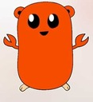

# gost

  [](./LICENSE)



Experience the true taste of Rust in Go

[document](https://pkg.go.dev/github.com/myyrakle/gost)

## Install

```
go get github.com/myyrakle/gost@v0.10.0
```

## Basic Principles

gost implements its main operations through primitive wrappers and traits.

So, you should use the ISize type instead of the int type, and the String type instead of the string type.

```
import (
	"math"

	. "github.com/myyrakle/gost"
)

func main() {
	a := ISize(1)
	b := ISize(2)
	c := a + b

	Println("{} + {} = {}", a, b, c) // "1 + 2 = 3"

	d := String("foo")
	Println(d) // "foo"
}
```

## Traits

gost defines common operations through a trait-type interface.
Most of the traits are similar to Rust's traits.

For example, the Clone trait defines deep copying.
This allows you to consistently define and use specific behaviors in a type-safe manner.

```
func DoSomethingWithClone[T any](source Clone[T]) {
	cloned := source.Clone()
	Println("{}", cloned)
}

func main() {
	vec := VecNew[I32]()
	vec.Push(I32(1))
	vec.Push(I32(2))
	DoSomethingWithClone[Vec[I32]](vec)
}
```

(Of course, there are limitations to type inference due to Go's poor generic support.)

The basic traits currently provided include the following, and are defined for most types.

- Clone
- Display
- Debug
- ToString
- Iterator
- AsRef
- Ord
- Eq
- Add
- Sub
- Mul
- Div
- Rem
- AddAssign
- SubAssign
- MulAssign
- DivAssign
- RemAssign

## Option and Result

gost handles errors through the rusty monad types Option and Result.

For example, CheckedAdd, a function that detects overflow and fails, returns an Option type.
If Option is None, it fails, and if Option is Some, it succeeds.

```
a := I8(150)
b := I8(555)

result := a.CheckedAdd(b)

if result.IsNone() {
	Println("overflow")
} else {
	Println("{}", result.Unwrap())
}
```

In normal Go, errors are controlled very loosely through regular pointers and tuples, but Option and Result allow for tighter restrictions.

## Collections

gost supports all of Rust's collection types: Vec, VecDeque, LinkedList, HashSet, HashMap, BTreeSet, BTreeMap, and BinaryHeap.
It is implemented as a generic, and traits and Iterators can be used.

vector sample

```
vec := VecNew[I32]()
vec.Push(I32(1))
vec.Push(I32(2))
vec.Push(I32(3))
vec.Push(I32(4))
Println("{}", vec)

otherVec := vec.IntoIter().Map(func (e I32) I32 { return e * 2 }).CollectToVec()
Println("{}", vec)
```

hashset sample

```
set := HashSetNew[I32]()
set.Insert(gost.I32(3))
set.Insert(gost.I32(4))
set.Insert(gost.I32(5))
set.Insert(gost.I32(6))
set.Insert(gost.I32(7))

Println("{}", set.Contains(I32(33)))
Println("{}", set.Contains(I32(3)))

Println("{}", set)
```
